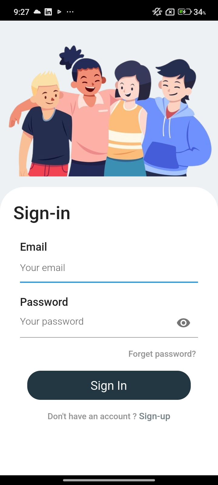
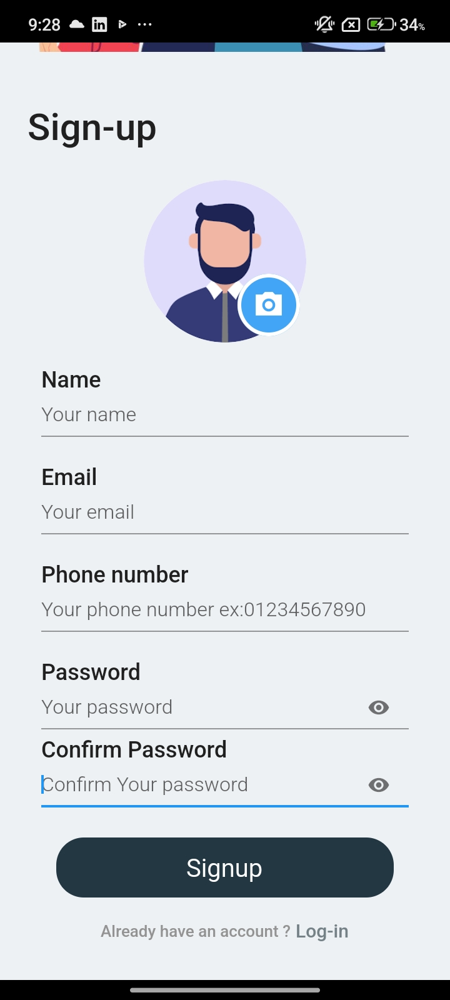

# Api Handling App 📱
## Flutter API Handling Practice

### This project is a practice Flutter application focused on working with APIs and implementing clean, scalable methods for handling the requests and responses. through error handling, and separation of concerns when interacting with remote data sources.

##### Key Highlights:

Organized API layer with base URL and endpoints.

Data fetching using dio, and exceptions handling.

Code separation for maintainability and readability

#### 🖼️ Screenshots

  
  

#### Note: This is not a complete application or even contains any real API, but it is a reference for me to use this  structure "API Handling" in other projects.
